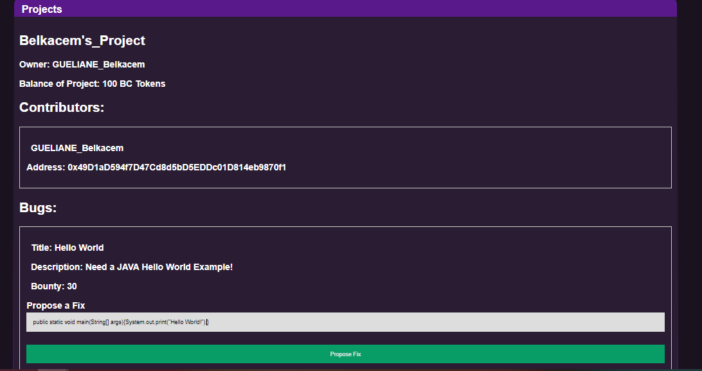

# Build Collective
## By GUELIANE Belkacem & LEE JaeSoo
Welcome Welcome 
What you're looking at is the emplimentation of an OpenCollective competitor
in a decentralized way, on the Ethereum blockchain as a backend. This will have cool side effects, like not
be forced to pay for servers, instead, we will destroy every electrical grid on earth as well as keep the GPU manifacturers busy, in search for privacy, decentralization, freedom and hapiness, just like god intended !!!

# Installation

```bash
# With HTTPS
git clone https://github.com/ghivert/build-collective.git
# Or with SSH
git clone git@github.com:ghivert/build-collective.git
```

You’ll need to install dependencies. You’ll need [`Ganache`](https://www.trufflesuite.com/ganache), [`Node.js`](https://nodejs.org/en/) and [`NPM`](https://www.npmjs.com/) or [`Yarn`](https://yarnpkg.com/). You’ll need to install [`Metamask`](https://metamask.io/) as well to communicate with your blockchain.

- `Ganache` is a local blockchain development, to iterate quickly and avoiding wasting Ether during development.
- `Node.js` is used to build the frontend and running `truffle`, which is a utility to deploy contracts.
- `NPM` or `Yarn` is a package manager, to install dependencies for your frontend development. Yarn is recommended.
- `Metamask` is a in-browser utility to interact with decentralized applications.

# Some setup

Once everything is installed, launch `Ganache`. Create a new workspace, give it a name, and accept. You should have a local blockchain running in local. Now you can copy the mnemonic phrase Ganache generated, open Metamask, and when it asks to import a mnemonic, paste the mnemonic. Create the password of your choice and that’s fine.
Now you can connect Metamask to the blockchain. To do this, add a network by clicking on `main network` and `personalized RPC`. Here, you should be able to add a network.


Once you have done it, you’re connected to the Ganache blockchain!

# Run the frontend

Install the dependencies.

```bash
# Yarn users
yarn
# NPM users
npm install
```

Compile the contracts.

```bash
# Yarn users
yarn contracts:migrate
# NPM users
npm run contracts:migrate
```

Create a symlink for your OS if this is not done for you.

```bash
# Windows
mklink /D src\build "..\build"

# Unix and macOS
ln -s ../build ./src/build
```

Run the frontend

```bash
# Yarn users
yarn serve
# NPM users
npm run serve
```

You’re good to go!

# Subject

Implement an OpenCollective from scratch in Solidity.

# Smart Contract

- Open user account, with a name and a balance.
- Open an entreprise account, with a name, an owner and some members, possibly with a balance.
- Create projects on which we can give money for sponsoring. Each project has a balance, a name and a list of contributors. Each project belongs to a user or an entreprise. The money given to the project can be send to contributors, and contributors only.
- On a project, you should be able to create bounties. Bounties are bugs with a reward: if you spot a bug and you want to have it fix quickly, open a bounty and put some eth on it. When the fix is pushed, the author will get the eth. He’s a bounty hunter.
- Add the ability to put some link to commits from GitHub or GitLab in the projects, to keep a track of what has been done.

# Front

- Create a page to open a user account. Remember, each user is identified by its wallet address.
- Create a page to open an entreprise account.
- Create a page to create a project.
- Create a page to get a full recap of everything that happened on a project as a timeline.

# Features

After connecting to Metamask and creating you account, you'll be guided to the main page with 2 tabs:

- The Account page 
- The Explore page

## Account Page
In the Account page, you'll be able to see your personal account, as well as have the ability to recharge your balance 


**all your transactions will be deducted from this balance**

you also have the ability to view and manage your company (add memebers..)


and finally you can create projects, add members as well as start **bounties** for the bugs that you want fixed 

you can also see a recap of all the associated projects, owned by others and of which you're a member 

## Explore Page 
On the explore page, you'll find a list with all the other users


once you click on one of them, you'll see their profile, their organisations, and a list of their projects 


on these projects you can donate


or if they have declared a bug, you can submit a fix:
in this example 

- GB declares a bug 
- LJ sees the bug on GB's page and submites a fix 



- GB then accepts the fix (visible only on his Account since h'es the owner) and the bounty is automatically transfered to LJ


